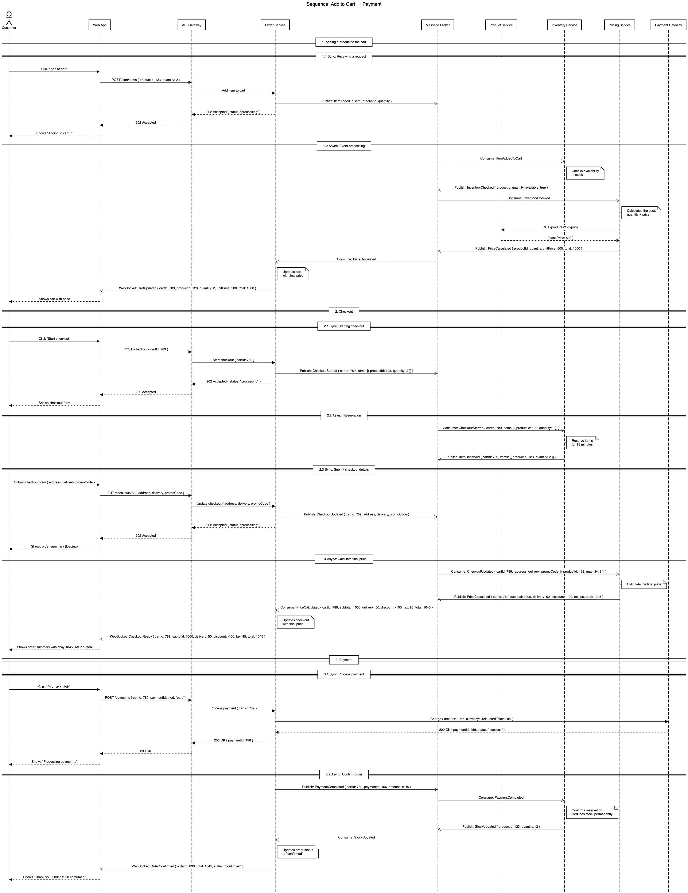
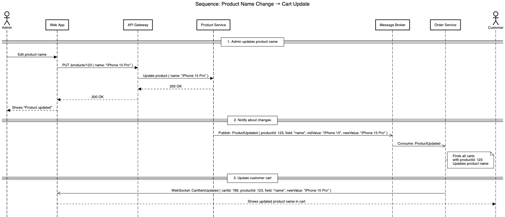
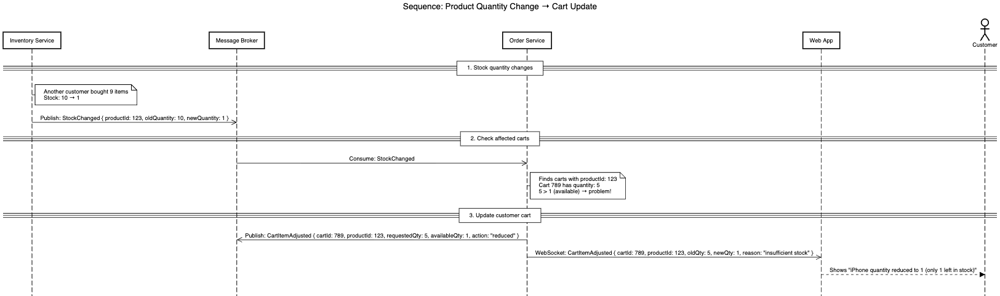

# Homework 03: Microservices Communication

## Зміст

- [Завдання 1: Sequence діаграма (Add to Cart → Payment)](#завдання-1-sequence-діаграма-add-to-cart--payment)
- [Завдання 2: Реакція кошика на зміну назви товару](#завдання-2-реакція-кошика-на-зміну-назви-товару)
- [Завдання 3: Реакція кошика на зміну наявної кількості товару](#завдання-3-реакція-кошика-на-зміну-наявної-кількості-товару)
- [Архітектурні рішення](#архітектурні-рішення)

---

## Архітектура системи

| Сервіс            | Роль                                       |
| ----------------- | ------------------------------------------ |
| Web App           | Frontend інтерфейс для клієнта             |
| API Gateway       | Точка входу, маршрутизація запитів         |
| Product Service   | Каталог товарів (назва, опис, фото)        |
| Inventory Service | Управління складом (наявність, резервація) |
| Pricing Service   | Ціноутворення (ціни, знижки, податки)      |
| Order Service     | Кошик та замовлення                        |
| Payment Gateway   | Зовнішня система обробки платежів          |
| Message Broker    | Асинхронна комунікація між сервісами       |

---

## Завдання 1: Sequence діаграма (Add to Cart → Payment)

### Опис

Побудована sequence діаграма процесу від додавання товару в кошик до оплати з використанням **Event-Driven Architecture (Choreography)**.

### Діаграма



### Етапи процесу

#### 1. Додавання товару в кошик

| Крок      | Опис                                                                                                              |
| --------- | ----------------------------------------------------------------------------------------------------------------- |
| 1.1 Sync  | Клієнт натискає "Add to cart", запит йде через Gateway до Order Service                                           |
| 1.2 Async | Order публікує подію `ItemAddedToCart` → Inventory перевіряє наявність → Pricing рахує ціну → Order оновлює кошик |

**Події:**

- `ItemAddedToCart { productId, quantity }`
- `InventoryChecked { productId, quantity, available }`
- `PriceCalculated { productId, quantity, unitPrice, total }`

#### 2. Checkout (Оформлення замовлення)

| Крок      | Опис                                                               |
| --------- | ------------------------------------------------------------------ |
| 2.1 Sync  | Клієнт натискає "Start checkout"                                   |
| 2.2 Async | Inventory резервує товар на 15 хвилин                              |
| 2.3 Sync  | Клієнт заповнює форму (адреса, доставка, промокод)                 |
| 2.4 Async | Pricing рахує фінальну ціну (товари + доставка + податки - знижка) |

**Події:**

- `CheckoutStarted { cartId, items }`
- `ItemReserved { cartId, items }`
- `CheckoutUpdated { cartId, address, delivery, promoCode }`
- `PriceCalculated { cartId, subtotal, delivery, discount, tax, total }`

#### 3. Payment (Оплата)

| Крок      | Опис                                                                         |
| --------- | ---------------------------------------------------------------------------- |
| 3.1 Sync  | Клієнт натискає "Pay", Order звертається до Payment Gateway                  |
| 3.2 Async | Після успішної оплати Inventory підтверджує резервацію, Order оновлює статус |

**Події:**

- `PaymentCompleted { cartId, paymentId, amount }`
- `StockUpdated { productId, quantity }`
- `OrderConfirmed { orderId, total, status }`

### Комунікація

| Тип                   | Використання                       |
| --------------------- | ---------------------------------- |
| Синхронна (HTTP)      | Клієнт ↔ Gateway ↔ Services        |
| Асинхронна (Events)   | Service ↔ Broker ↔ Service         |
| Real-time (WebSocket) | Order Service → Web App → Customer |

---

## Завдання 2: Реакція кошика на зміну назви товару

### Опис

Механізм автоматичного оновлення кошика, коли адміністратор змінює назву товару в каталозі.

### Діаграма



### Механізм

```
Admin змінює назву товару
    ↓
Product Service оновлює БД
    ↓
Product Service публікує подію ProductUpdated
    ↓
Order Service отримує подію
    ↓
Order Service знаходить всі кошики з цим товаром
    ↓
Order Service оновлює назву в кошиках
    ↓
Клієнт отримує оновлення через WebSocket
```

### Подія

```json
{
  "event": "ProductUpdated",
  "data": {
    "productId": 123,
    "field": "name",
    "oldValue": "iPhone 15",
    "newValue": "iPhone 15 Pro"
  }
}
```

### Учасники

| Сервіс          | Роль                            |
| --------------- | ------------------------------- |
| Product Service | Публікує подію `ProductUpdated` |
| Message Broker  | Доставляє подію підписникам     |
| Order Service   | Слухає подію, оновлює кошики    |
| Web App         | Отримує WebSocket повідомлення  |

### Переваги підходу

- **Слабка зв'язність** — Product Service не знає про Order Service
- **Real-time оновлення** — клієнт бачить зміни одразу
- **Масштабованість** — легко додати інших підписників

---

## Завдання 3: Реакція кошика на зміну наявної кількості товару

### Опис

Механізм автоматичного коригування кошика, коли кількість товару на складі стає меншою за кількість в кошику клієнта.

### Діаграма



### Сценарій

```
Початковий стан:
- На складі: 10 iPhone
- В кошику клієнта: 5 iPhone

Подія:
- Інший клієнт купив 9 iPhone
- На складі залишилось: 1 iPhone

Проблема:
- В кошику: 5, на складі: 1
- 5 > 1 → потрібно коригування

Рішення:
- Зменшити кількість в кошику до 1
- Повідомити клієнта
```

### Механізм

```
Кількість на складі змінюється
    ↓
Inventory Service публікує подію StockChanged
    ↓
Order Service отримує подію
    ↓
Order Service перевіряє всі кошики з цим товаром
    ↓
Якщо (кількість в кошику > кількість на складі):
    → Зменшити кількість в кошику
    → Опублікувати подію CartItemAdjusted
    ↓
Клієнт отримує повідомлення через WebSocket
```

### Події

**Вхідна подія:**

```json
{
  "event": "StockChanged",
  "data": {
    "productId": 123,
    "oldQuantity": 10,
    "newQuantity": 1
  }
}
```

**Вихідна подія:**

```json
{
  "event": "CartItemAdjusted",
  "data": {
    "cartId": 789,
    "productId": 123,
    "requestedQty": 5,
    "availableQty": 1,
    "action": "reduced",
    "reason": "insufficient stock"
  }
}
```

### Логіка обробки

```
FOR кожен кошик з productId:
    IF cart.quantity > available.quantity:
        cart.quantity = available.quantity
        NOTIFY customer "Кількість зменшено до {available}"
    ELSE:
        // Все ОК, нічого не робимо
```

### Переваги підходу

- **Автоматичне коригування** — клієнт не зможе замовити більше ніж є
- **Прозорість** — клієнт бачить причину зміни
- **Консистентність** — кошик завжди відображає реальний стан складу

---

## Архітектурні рішення

### Event-Driven Architecture (Choreography)

Обрано підхід **Choreography** замість Orchestration:

| Аспект                  | Choreography | Orchestration  |
| ----------------------- | ------------ | -------------- |
| Зв'язність              | Слабка       | Сильна         |
| Single Point of Failure | Немає        | Оркестратор    |
| Складність              | Розподілена  | Централізована |
| Масштабованість         | Висока       | Обмежена       |

### Патерни комунікації

| Патерн                           | Використання                                |
| -------------------------------- | ------------------------------------------- |
| **Publish/Subscribe**            | Сервіси публікують події, інші підписуються |
| **Event Carried State Transfer** | Події містять повні дані (не тільки ID)     |
| **WebSocket Push**               | Real-time оновлення для клієнтів            |

### Формат подій

```json
{
  "event": "EventName",
  "timestamp": "2024-01-20T12:00:00Z",
  "data": {
    "field1": "value1",
    "field2": "value2"
  }
}
```

---

### Ключові концепції

1. **Event-Driven Architecture** — сервіси спілкуються через події
2. **Choreography** — кожен сервіс знає свою роль, немає центрального координатора
3. **Message Broker** — забезпечує надійну доставку подій
4. **WebSocket** — real-time оновлення для клієнтів
5. **Резервація товару** — запобігає overselling

### Використані інструменти

- **PlantUML / SequenceDiagram.org** — створення діаграм
- **Event Storming concepts** — моделювання подій

---
