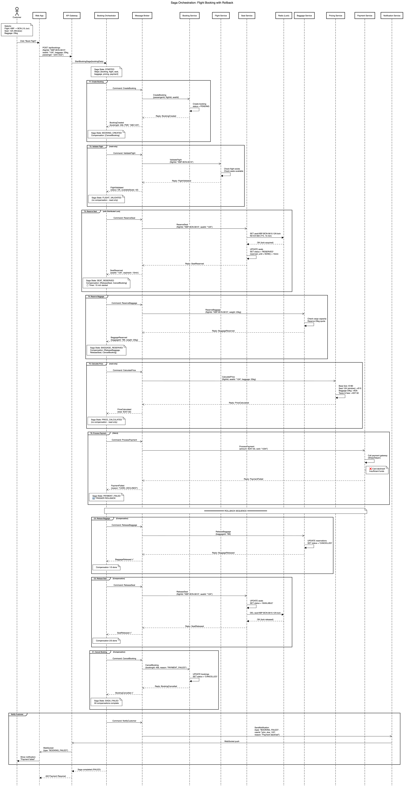

# Homework 04: Transactions & Distributed Locks

## Зміст

- [Завдання 1: Sequence діаграма процесу відкату](#завдання-1-sequence-діаграма-процесу-відкату)
  - [1.1 Архітектура системи](#11-архітектура-системи)
  - [1.2 Saga Pattern](#12-saga-pattern)
  - [1.3 Orchestration vs Choreography](#13-orchestration-vs-choreography)
  - [1.4 Діаграма](#14-діаграма)
  - [1.5 Етапи процесу](#15-етапи-процесу)
  - [1.6 Типи стрілок](#16-типи-стрілок)
- [Завдання 2: Логіка локу товару](#завдання-2-логіка-локу-товару)
  - [2.1 Проблема: Race Condition](#21-проблема-race-condition)
  - [2.2 Рішення: Distributed Lock (Redis)](#22-рішення-distributed-lock-redis)
  - [2.3 Алгоритм роботи](#23-алгоритм-роботи)
  - [2.4 Приклад коду](#24-приклад-коду)
- [Завдання 3: Що може піти не так з локом](#завдання-3-що-може-піти-не-так-з-локом)
  - [3.1 Lock не звільнився](#31-lock-не-звільнився)
  - [3.2 TTL закінчився передчасно](#32-ttl-закінчився-передчасно)
  - [3.3 Redis недоступний](#33-redis-недоступний)
  - [3.4 Race Condition при перевірці](#34-race-condition-при-перевірці)
  - [3.5 Split Brain (Network Partition)](#35-split-brain-network-partition)
  - [3.6 Неправильне звільнення чужого локу](#36-неправильне-звільнення-чужого-локу)

---

## Домен: Бронювання авіаквитків

| Параметр         | Значення                            |
| ---------------- | ----------------------------------- |
| Сценарій         | Клієнт бронює рейс Київ → Барселона |
| Патерн           | Saga Orchestration                  |
| Lock механізм    | Redis Distributed Lock              |
| Lock TTL         | 15 хвилин                           |
| Failure сценарій | Платіж відхилено (Card Declined)    |

---

## Завдання 1: Sequence діаграма процесу відкату

### 1.1 Архітектура системи

| Сервіс               | Роль                                       |
| -------------------- | ------------------------------------------ |
| Web App              | Frontend інтерфейс для клієнта             |
| API Gateway          | Точка входу, маршрутизація запитів         |
| Booking Orchestrator | Координатор Saga — керує всім процесом     |
| Message Broker       | Асинхронна комунікація (команди/відповіді) |
| Booking Service      | Створення та управління бронюваннями       |
| Flight Service       | Інформація про рейси, валідація            |
| Seat Service         | Резервація місць + distributed lock        |
| Redis                | Зберігання distributed locks               |
| Baggage Service      | Резервація багажу                          |
| Pricing Service      | Розрахунок вартості                        |
| Payment Service      | Обробка платежів                           |
| Notification Service | Сповіщення користувачів                    |

**Архітектура:**

```
┌─────────────────────────────────────────────────────────────────┐
│                         Customer                                │
└─────────────────────────────┬───────────────────────────────────┘
                              │
                              ▼
┌─────────────────────────────────────────────────────────────────┐
│                         Web App                                 │
└─────────────────────────────┬───────────────────────────────────┘
                              │
                              ▼
┌─────────────────────────────────────────────────────────────────┐
│                       API Gateway                               │
└─────────────────────────────┬───────────────────────────────────┘
                              │
                              ▼
┌─────────────────────────────────────────────────────────────────┐
│                   Booking Orchestrator                          │
│                    (Saga Coordinator)                           │
└─────────────────────────────┬───────────────────────────────────┘
                              │
                              ▼
┌─────────────────────────────────────────────────────────────────┐
│                      Message Broker                             │
│                   (RabbitMQ / Kafka)                            │
└───┬─────────┬─────────┬─────────┬─────────┬─────────┬───────────┘
    │         │         │         │         │         │
    ▼         ▼         ▼         ▼         ▼         ▼
┌───────┐ ┌───────┐ ┌───────┐ ┌───────┐ ┌───────┐ ┌───────┐
│Booking│ │Flight │ │ Seat  │ │Baggage│ │Pricing│ │Payment│
│Service│ │Service│ │Service│ │Service│ │Service│ │Service│
└───────┘ └───────┘ └───┬───┘ └───────┘ └───────┘ └───────┘
                        │
                        ▼
                   ┌─────────┐
                   │  Redis  │
                   │ (Locks) │
                   └─────────┘
```

---

### 1.2 Saga Pattern

**Що таке Saga?**

В моноліті все просто — одна БД, одна транзакція:

```sql
BEGIN TRANSACTION;
  UPDATE inventory SET quantity = quantity - 1;
  UPDATE accounts SET balance = balance - 100;
  INSERT INTO orders (...);
COMMIT; -- або ROLLBACK якщо щось впало
```

В мікросервісах кожен сервіс має **свою базу** — немає спільної транзакції.

**Saga** — це послідовність локальних транзакцій, де кожна транзакція оновлює один сервіс. Замість одного `ROLLBACK` — серія **компенсаційних транзакцій**:

```
Звичайна транзакція:    T1 → T2 → T3 → T4
                                      ↓ (падає)
Компенсація:            C1 ← C2 ← C3 ←┘
```

---

### 1.3 Orchestration vs Choreography

| Аспект                  | Orchestration           | Choreography                       |
| ----------------------- | ----------------------- | ---------------------------------- |
| Керування               | Центральний координатор | Кожен сервіс сам вирішує           |
| Комунікація             | Commands (накази)       | Events (події)                     |
| Семантика               | "Зроби щось"            | "Щось сталося"                     |
| Rollback                | Orchestrator керує      | Кожен сервіс слухає failure events |
| Складність              | В одному місці          | Розподілена                        |
| Single Point of Failure | Так (Orchestrator)      | Ні                                 |
| Видимість flow          | Легко зрозуміти         | Важко відслідкувати                |

**Обрано: Orchestration** — для наочності rollback процесу та централізованого керування.

---

### 1.4 Діаграма



**Код діаграми:** [saga-orchestration-rollback.puml](saga-orchestration-rollback.puml)

---

### 1.5 Етапи процесу

#### Транзакції (Happy Path)

| #   | Транзакція      | Сервіс       | Опис                             | Компенсація     |
| --- | --------------- | ------------ | -------------------------------- | --------------- |
| T1  | Create Booking  | Booking      | Створити бронювання (PENDING)    | CancelBooking   |
| T2  | Validate Flight | Flight       | Перевірити рейс (read-only)      | —               |
| T3  | Reserve Seat    | Seat + Redis | Зарезервувати місце + lock       | ReleaseSeat     |
| T4  | Reserve Baggage | Baggage      | Зарезервувати багаж              | ReleaseBaggage  |
| T5  | Calculate Price | Pricing      | Розрахувати вартість (read-only) | —               |
| T6  | Process Payment | Payment      | Списати кошти                    | RefundPayment\* |

\*RefundPayment потрібен тільки якщо оплата пройшла успішно.

#### Failure Scenario: Card Declined

```
T1 ✅ → T2 ✅ → T3 ✅ → T4 ✅ → T5 ✅ → T6 ❌ (CARD_DECLINED)
                                          │
                                          ▼
                              ══════ ROLLBACK ══════
                                          │
                              C3: ReleaseBaggage ✅
                                          │
                              C2: ReleaseSeat ✅
                                          │
                              C1: CancelBooking ✅
```

#### Компенсації (Rollback Sequence)

| #   | Компенсація    | Сервіс       | Опис                            |
| --- | -------------- | ------------ | ------------------------------- |
| C3  | ReleaseBaggage | Baggage      | Звільнити багажну квоту         |
| C2  | ReleaseSeat    | Seat + Redis | Звільнити місце + видалити lock |
| C1  | CancelBooking  | Booking      | Скасувати бронювання            |

**Важливо:**

- Компенсації виконуються у **зворотному порядку**
- T2 і T5 — read-only, компенсація не потрібна
- T6 не потребує компенсації, бо платіж не пройшов

---

### 1.6 Типи стрілок

| Стрілка | Синтаксис           | Тип            | Використання                            |
| ------- | ------------------- | -------------- | --------------------------------------- |
| `->`    | Суцільна, закрита   | Sync request   | HTTP запит (Customer → Gateway)         |
| `-->`   | Пунктирна, закрита  | Sync response  | HTTP відповідь                          |
| `->>`   | Суцільна, відкрита  | Async message  | Команда в чергу (Orchestrator → Broker) |
| `-->>`  | Пунктирна, відкрита | Async response | Відповідь через чергу                   |

---

## Завдання 2: Логіка локу товару

### 2.1 Проблема: Race Condition

Два клієнти одночасно хочуть забронювати місце 12A:

```
Час     Клієнт А                         Клієнт Б
─────────────────────────────────────────────────────────────
0ms     SELECT seat WHERE id='12A'
5ms                                      SELECT seat WHERE id='12A'
10ms    // status = AVAILABLE
15ms                                     // status = AVAILABLE
20ms    UPDATE seat SET status='RESERVED'
25ms                                     UPDATE seat SET status='RESERVED'
30ms    // Success!
35ms                                     // Success!

💀 Результат: Обидва думають, що забронювали місце 12A
```

---

### 2.2 Рішення: Distributed Lock (Redis)

**Чому Redis?**

| Рішення                           | Плюси                         | Мінуси                             |
| --------------------------------- | ----------------------------- | ---------------------------------- |
| Database Lock (SELECT FOR UPDATE) | Просто                        | Не працює між сервісами/інстансами |
| Redis Distributed Lock            | Швидкий, працює між сервісами | Потребує Redis                     |
| Zookeeper                         | Надійний, CP-система          | Складний, повільніший              |

**Redis команда:**

```
SET seat:KBP-BCN-0615:12A:lock <unique_id> NX EX 900
```

| Параметр | Значення                     | Опис                                  |
| -------- | ---------------------------- | ------------------------------------- |
| Key      | `seat:KBP-BCN-0615:12A:lock` | Унікальний ключ для ресурсу           |
| Value    | `<unique_id>`                | UUID процесу (для безпечного release) |
| NX       | —                            | Тільки якщо ключ НЕ існує (атомарно)  |
| EX       | 900                          | TTL 15 хвилин (900 секунд)            |

**Результат:**

- `OK` — lock отримано
- `NULL` — lock вже тримає хтось інший

---

### 2.3 Алгоритм роботи

#### Acquire Lock (Отримання)

```
1. Клієнт хоче забронювати місце 12A
           ↓
2. Seat Service → Redis: SET lock NX EX 900
           ↓
3. Redis повертає OK?
           ↓
   ТАК → Lock отримано → Зберігаємо місце в БД
   НІ → Повертаємо помилку: "Місце резервується іншим клієнтом"
```

#### Release Lock (Звільнення)

```
1. Після успішної оплати АБО при rollback
           ↓
2. Seat Service → Redis: DEL lock (з перевіркою власника!)
           ↓
3. Місце знову доступне для інших
```

#### TTL Expiration (Автоматичне звільнення)

```
1. Клієнт не оплатив за 15 хвилин
           ↓
2. Redis автоматично видаляє ключ (TTL expired)
           ↓
3. Lock звільняється без втручання
           ↓
4. Orchestrator отримує timeout → запускає rollback
```

---

### 2.4 Приклад коду

```typescript
import Redis from "ioredis";
import { v4 as uuidv4 } from "uuid";

const redis = new Redis();
const LOCK_TTL = 900; // 15 хвилин

interface LockResult {
  success: boolean;
  lockId?: string;
  error?: string;
}

// ===== ACQUIRE LOCK =====
async function acquireSeatLock(
  flightId: string,
  seatId: string,
): Promise<LockResult> {
  const lockKey = `seat:${flightId}:${seatId}:lock`;
  const lockId = uuidv4(); // Унікальний ID для цієї резервації

  // Атомарна операція: створити ключ тільки якщо не існує
  const acquired = await redis.set(
    lockKey,
    lockId,
    "NX", // Only if Not eXists
    "EX", // Expire time
    LOCK_TTL, // 900 секунд
  );

  if (!acquired) {
    return {
      success: false,
      error: "SEAT_ALREADY_LOCKED",
    };
  }

  return {
    success: true,
    lockId: lockId,
  };
}

// ===== RELEASE LOCK =====
async function releaseSeatLock(
  flightId: string,
  seatId: string,
  lockId: string,
): Promise<boolean> {
  const lockKey = `seat:${flightId}:${seatId}:lock`;

  // Lua script для атомарного release
  // Видаляємо ТІЛЬКИ якщо ми власник локу
  const script = `
    if redis.call("GET", KEYS[1]) == ARGV[1] then
      return redis.call("DEL", KEYS[1])
    else
      return 0
    end
  `;

  const released = await redis.eval(script, 1, lockKey, lockId);
  return released === 1;
}

// ===== USAGE IN SEAT SERVICE =====
async function reserveSeat(flightId: string, seatId: string) {
  // 1. Отримуємо lock
  const lock = await acquireSeatLock(flightId, seatId);

  if (!lock.success) {
    throw new Error("Seat is being reserved by another customer");
  }

  // 2. Оновлюємо БД
  await db.seats.update({
    where: { flightId, seatId },
    data: {
      status: "RESERVED",
      reservedUntil: new Date(Date.now() + LOCK_TTL * 1000),
      lockId: lock.lockId,
    },
  });

  return {
    seatId,
    lockId: lock.lockId,
    expiresIn: LOCK_TTL,
  };
}

async function releaseSeat(flightId: string, seatId: string, lockId: string) {
  // 1. Звільняємо lock в Redis
  const released = await releaseSeatLock(flightId, seatId, lockId);

  if (!released) {
    console.warn("Lock was already released or owned by another process");
  }

  // 2. Оновлюємо БД
  await db.seats.update({
    where: { flightId, seatId },
    data: {
      status: "AVAILABLE",
      reservedUntil: null,
      lockId: null,
    },
  });
}
```

---

## Завдання 3: Що може піти не так з локом

### 3.1 Lock не звільнився

**Проблема:** Сервіс впав після отримання lock, але до його звільнення.

```
1. Seat Service отримує lock
2. Seat Service падає (crash, OOM, network)
3. Lock залишається в Redis
4. Місце 12A заблоковане назавжди 💀
```

**Рішення: TTL (Time To Live)**

```
SET lock NX EX 900  // Автоматично видалиться через 15 хв
```

Redis сам видалить lock після TTL, навіть якщо сервіс не відповідає.

✅ **Висновок:** Завжди використовувати TTL для locks.

---

### 3.2 TTL закінчився передчасно

**Проблема:** Операція займає більше часу ніж TTL.

```
1. Клієнт А отримує lock (TTL = 15 хв)
2. Клієнт А повільно заповнює форму... ☕
3. Через 15 хв TTL закінчується, Redis видаляє lock
4. Клієнт Б отримує lock на те саме місце
5. Клієнт А завершує оплату
6. 💀 Обидва мають підтверджене бронювання на місце 12A!
```

**Рішення: Lock Extension (Watchdog)**

```typescript
// Фоновий процес продовжує TTL поки операція активна
class LockWatchdog {
  private intervalId: NodeJS.Timeout;

  start(lockKey: string, lockId: string, ttl: number) {
    // Кожні TTL/3 секунд перевіряємо і продовжуємо
    this.intervalId = setInterval(
      async () => {
        const extended = await this.extendLock(lockKey, lockId, ttl);
        if (!extended) {
          // Lock втрачено — зупиняємо операцію
          this.stop();
          throw new Error("Lock lost");
        }
      },
      (ttl / 3) * 1000,
    );
  }

  private async extendLock(key: string, id: string, ttl: number) {
    const script = `
      if redis.call("GET", KEYS[1]) == ARGV[1] then
        return redis.call("EXPIRE", KEYS[1], ARGV[2])
      else
        return 0
      end
    `;
    return await redis.eval(script, 1, key, id, ttl);
  }

  stop() {
    clearInterval(this.intervalId);
  }
}
```

✅ **Висновок:** Для довгих операцій використовувати watchdog для продовження TTL.

---

### 3.3 Redis недоступний

**Проблема:** Redis впав або недоступний через мережу.

```
1. Seat Service → Redis: SET lock
2. Redis недоступний (crash, network partition)
3. Seat Service не може отримати lock
4. Всі бронювання зупиняються 💀
```

**Рішення 1: Fallback на database lock**

```typescript
async function acquireLockWithFallback(flightId: string, seatId: string) {
  try {
    // Спочатку пробуємо Redis
    return await acquireRedisLock(flightId, seatId);
  } catch (redisError) {
    console.warn("Redis unavailable, falling back to DB lock");
    // Fallback на SELECT FOR UPDATE
    return await acquireDatabaseLock(flightId, seatId);
  }
}
```

**Рішення 2: Redis Cluster / Sentinel**

```
┌─────────┐     ┌─────────┐     ┌─────────┐
│ Redis   │     │ Redis   │     │ Redis   │
│ Master  │────▶│ Replica │────▶│ Replica │
└─────────┘     └─────────┘     └─────────┘
     │
     ▼
┌─────────┐
│Sentinel │ ← автоматичний failover
└─────────┘
```

✅ **Висновок:** Використовувати Redis Cluster/Sentinel або мати fallback стратегію.

---

### 3.4 Race Condition при перевірці

**Проблема:** Check-then-act без атомарності.

```typescript
// ❌ НЕПРАВИЛЬНО — race condition!
async function badAcquireLock(key: string) {
  const exists = await redis.exists(key); // Крок 1: перевірка
  if (!exists) {
    await redis.set(key, "locked"); // Крок 2: встановлення
    return true;
  }
  return false;
}
```

```
Час     Процес А                    Процес Б
────────────────────────────────────────────────────
0ms     EXISTS key → 0 (не існує)
5ms                                 EXISTS key → 0 (не існує)
10ms    SET key "locked"
15ms                                SET key "locked"
20ms    // думає що має lock
25ms                                // теж думає що має lock 💀
```

**Рішення: Атомарна операція NX**

```typescript
// ✅ ПРАВИЛЬНО — атомарна операція
async function goodAcquireLock(key: string, value: string, ttl: number) {
  // SET з NX — атомарно перевіряє І встановлює
  const result = await redis.set(key, value, "NX", "EX", ttl);
  return result === "OK";
}
```

✅ **Висновок:** Завжди використовувати атомарні операції (`SET NX`), ніколи не розділяти check і act.

---

### 3.5 Split Brain (Network Partition)

**Проблема:** Мережевий розділ між Redis нодами.

```
       Network Partition
            ║
┌───────────║───────────┐
│           ║           │
│  ┌─────┐  ║  ┌─────┐  │
│  │Redis│  ║  │Redis│  │
│  │Node1│  ║  │Node2│  │
│  └──┬──┘  ║  └──┬──┘  │
│     │     ║     │     │
│  ┌──▼──┐  ║  ┌──▼──┐  │
│  │App A│  ║  │App B│  │
│  └─────┘  ║  └─────┘  │
│           ║           │
└───────────║───────────┘

App A отримує lock на Node1
App B отримує lock на Node2
💀 Обидва мають lock на той самий ресурс!
```

**Рішення: Redlock Algorithm**

```typescript
// Redlock — алгоритм від творців Redis
// Потребує непарну кількість незалежних Redis інстансів (зазвичай 5)

import Redlock from "redlock";

const redlock = new Redlock([redis1, redis2, redis3, redis4, redis5], {
  retryCount: 3,
  retryDelay: 200,
});

// Lock вважається отриманим якщо більшість (3 з 5) підтвердили
const lock = await redlock.acquire(["seat:12A:lock"], 15000);
```

✅ **Висновок:** Для критичних систем використовувати Redlock з кількома незалежними Redis інстансами.

---

### 3.6 Неправильне звільнення чужого локу

**Проблема:** Процес звільняє lock, який йому не належить.

```
1. Процес А отримує lock (lockId = "aaa")
2. TTL закінчується, Redis видаляє lock
3. Процес Б отримує lock (lockId = "bbb")
4. Процес А намагається звільнити lock
5. Процес А виконує DEL key
6. 💀 Процес А видалив lock процесу Б!
```

**Рішення: Перевірка власника перед видаленням**

```typescript
// ❌ НЕПРАВИЛЬНО — видаляє будь-який lock
await redis.del(lockKey);

// ✅ ПРАВИЛЬНО — видаляє тільки свій lock (Lua script для атомарності)
const script = `
  if redis.call("GET", KEYS[1]) == ARGV[1] then
    return redis.call("DEL", KEYS[1])
  else
    return 0
  end
`;
await redis.eval(script, 1, lockKey, myLockId);
```

✅ **Висновок:** Завжди зберігати унікальний lockId і перевіряти власника перед звільненням.

---

## Підсумок проблем та рішень

| #   | Проблема              | Рішення                           |
| --- | --------------------- | --------------------------------- |
| 1   | Lock не звільнився    | TTL на кожен lock                 |
| 2   | TTL закінчився рано   | Watchdog для продовження          |
| 3   | Redis недоступний     | Cluster/Sentinel + fallback       |
| 4   | Race condition        | Атомарні операції (SET NX)        |
| 5   | Split brain           | Redlock algorithm                 |
| 6   | Видалення чужого локу | Перевірка lockId через Lua script |

---

## Висновки

| Завдання                   | Статус |
| -------------------------- | ------ |
| Sequence діаграма rollback | ✅     |
| Логіка локу (Redis)        | ✅     |
| Проблеми з локами          | ✅     |

### Ключові концепції

1. **Saga Pattern** — управління розподіленими транзакціями через компенсації
2. **Orchestration** — центральний координатор керує flow і rollback
3. **Distributed Lock** — синхронізація між сервісами через Redis
4. **TTL** — автоматичне звільнення локів для запобігання deadlocks
5. **Атомарність** — SET NX для безпечного отримання локу
6. **Redlock** — алгоритм для надійного locking в розподілених системах

### Використані інструменти

- SequenceDiagram.org — створення діаграм
- Redis — distributed locking
- Message Broker (RabbitMQ/Kafka) — асинхронна комунікація

---
